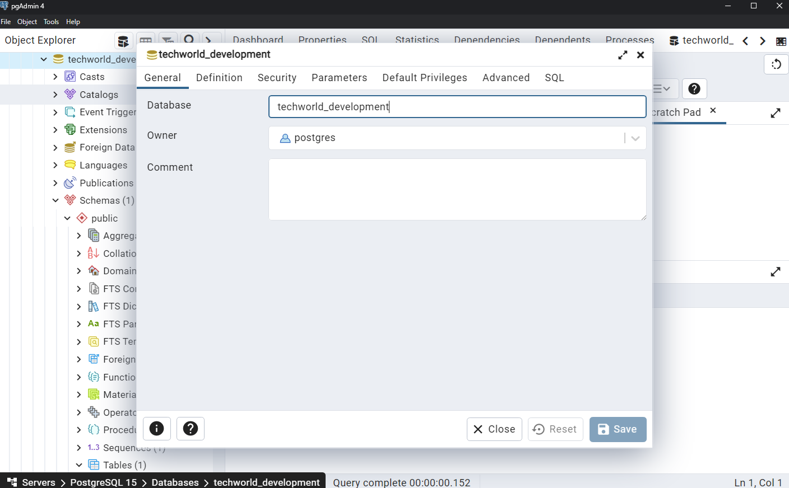
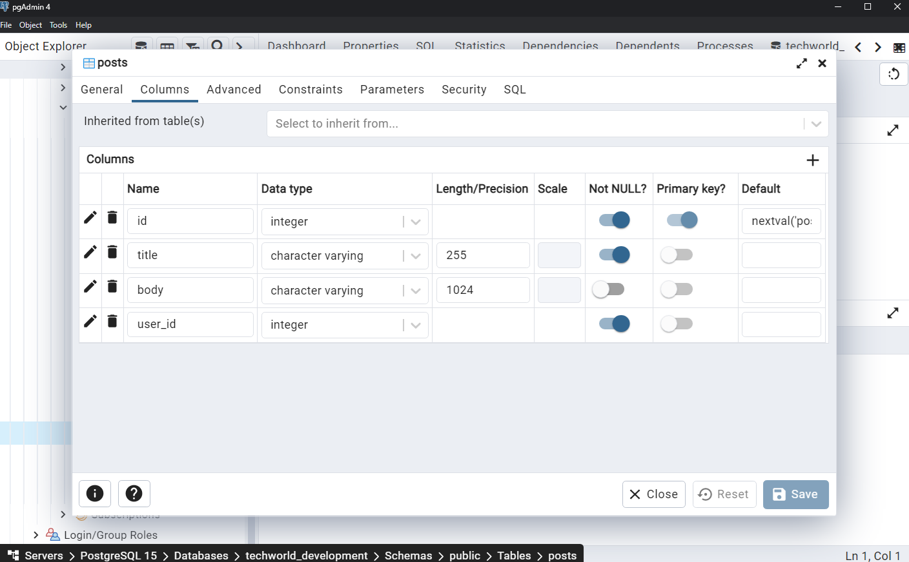

# Further Introduction to React.js

Video: <https://www.youtube.com/watch?v=kNk_ycw5uM8>

## Adding Express.js backend

Video: <https://www.youtube.com/watch?v=N9Xg9zu5v4I>

## Integrating PostgreSQL Database with pgAdmin

Video: <https://www.youtube.com/watch?v=CmxQ-R7YgJg>

## Requirements

- PostgreSQL; pgAdmin (or psql if you want to do it yourself, by hand)
- Node.js & NPM
- Terminal of your choice
- Visual Studio Code or any other editor

## How to Run

### Database Preparation

Open pgAdmin and create a database. For example, `techworld_development`:



Then create the table `posts` with properties like the following (use `SERIAL` type for id column):



### Environment File

Copy `.env.example` to a new file `.env`. Then fill in the values for each variable.

```
# macOS / Linux
cp .env.example .env

# Windows
copy .env.example .env
```

### Dependencies

Install dependencies:

```
npm install
```

### Powering up the Development Servers

Have two terminal windows, one for backend server:

```
# todo: make npm run server
node ./server/index.js
```

And another for the frontend client:

```sh
npm start
```
